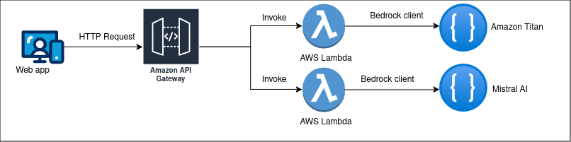

# Amazon Bedrock: Leveraging Foundation Models with Quarkus and AWS
Bedrock is the new Amazon's service which democratizes the users' access to the most uptodate Foundation Models (FM) made 
available by some of the highest ranked AI actors. Their list is quite impressive and it includes but isn't limited to:
  - Titan
  - Claude
  - Mistral AI 
  - Llama2
  - ...

Depending on your AWS region, some of these FMs might not be available. For example, as per this post, in my region, 
which is `eu-west-3` the only available FMs are Titan and Mistral AI, but things are changing very fast.

So, what's the point of using this service which, apparently, doesn't do anything else than giving you access to other 
FMs ? Well, the added value of Amazon Bedrock is to expose via APIs all these FMs, giving you the opportunity to easily 
integrate generative AI in your applications, through ubiquitous techniques like Serverless or REST. This is what this 
post is trying to demonstrate. So, let's go !

## A Generative AI Gateway
The project chosen in order to illustrate this post is showing a Generative AI Gateway, where the user is given access to 
a certain number of FMs, each one being specialized in a different type of use case like, for example, text generation, 
conversational interfaces, text summarization, image generation, etc.

The diagram below shows the general architecture of the sample application.

The sample application architecture diagram

As you can see, the sample application consists in the following components:
  - A web front-end which allows the user to select an FM, to configure its parameters, like the `temperature`, the `max tokens`, etc. and to start the dialog with it, for examples asking questions. Our application being a Quarkus one, we are using here the `quarkus-primefaces` extension.
  - An AWS REST Gateway which aims at exposing dedicated endpoints, depending on the chosen FM. Here we're using the `quarkus-amazon-lambda-rest` extension which, as you'll see soon, is able to automatically generate the SAM (*Serverless Application Model*) template required to deploy the REST Gateway to AWS.
  - Several REST endpoints processing POST requests and aiming at invoking the chosen FM via a Bedrock client. The FM responses are brought back to our web application, through the REST Gateway.

Let's look now in greater details at the implementation.

### The REST Gateway
The module `bedrock-gateway-api` of our Maven multi-module project, implements this component. It consists in a Quarkus
RESTeasy API exposing several endpoints which are processing POST requests, having the user interaction as input parameters
and returning the FM responses. The input parameters are strings and, in the case where the user requests result in really 
large amount of text, they are input files.

The endpoints process these POST requests by converting the associated input into an FM specific syntax, including the 
following parameters: 
  - the `temperature`: a real number between 0 and 1 which aims at influencing the FM's predictability. A lower value consists in a more predictable output while a higher one will generate a more random response.
  - the `top P`: a real number between 0 and 1 which value is supposed to select the most likely tokens in a distribution. A lower value results in a more limited number of choices for the response.
  - the `max-tokens`: an integer value representing the maximum number of words that the FM will process for any given request.

The Bedrock documentation is at your disposal in order to bring you all the required missing details concerning the parameters
above, which meaning, I have to admit, I didn't completely understand.

The Bedrock client used to interact with the FM service is instatiated as shown below:

    private final BedrockRuntimeAsyncClient client = BedrockRuntimeAsyncClient.builder().region(Region.EU_WEST_3).build();

This requires using the following Maven artifact:

    <dependency>
      <groupId>software.amazon.awssdk</groupId>
      <artifactId>bedrockruntime</artifactId>
    </dependency>

There is a synchronous and an asynchronous Bedrock client and, given the relative latency generally associated with an FM
invocation, we have chose the 2nd one.

### The Web Front-end
The Web front-end is a simple Jakarta Faces application implemented using the PrimeFaces library as well as the Facelets
notation in order to define the layouts. And if this architecture choice might surprize the reader more used to 
JavaScript/TypeScript based front-ends, then please have a look at https://dzone.com/articles/micro-frontends-for-quarkus-microservices.

The only more special thing to be noticed is the way it uses the Microprofile JAX-RS Client implementation by Quarkus to
call the AWS REST Gateway.

    @RegisterRestClient
    @Path("/bedrock")
    @Produces(MediaType.TEXT_PLAIN)
    @Consumes(MediaType.APPLICATION_JSON)
    public interface BedrockAiEndpoint
    {
      @POST
      @Path("mistral2")
      Response callMistralFm (BedrockAiInputParam bedrockAiInputParam);
      @POST
      @Path("titan2")
      Response callTitanFm (BedrockAiInputParam bedrockAiInputParam);
    }

This interface is all that's required, Quarkus will generate from it the associated implementation client class.

## Running the sample application
The application can be run in two ways:
  - executing locally the AWS REST Gateway and the associated AWS Lambda endpoints;
  - executing in the cloud the AWS REST Gateway and the associated AWS Lambda endpoints.
### Running locally
The shell script named `run-local.sh` runs locally the AWS REST Gateway together with the associated AWS Lambda endpoints.
Here is the code:

    #!/bin/bash
    mvn -Durl=http://localhost:3000 clean install
    sed -i 's/java11/java17/g' bedrock-gateway-api/target/sam.jvm.yaml
    sam local start-api -t ./bedrock-gateway-api/target/sam.jvm.yaml --log-file ./bedrock-gateway-api/sam.log &
    mvn -DskipTests=false failsafe:integration-test
    docker run --name bedrock -p 8082:8082 --rm --network host nicolasduminil/bedrock-gateway-web:1.0-SNAPSHOT
    ./cleanup-local.sh

The first thing that we need to do here is to build application by running the Maven command. This will result, among
others, in a Docker image named `nicolasduminil/bedrock-gateway-web` which is dedicated to run the web front-end. It also
will result in the generation by Quarkus of the SAM template (`target\sam.jvm.yam`) that creates the AWS CloudFormation 
stack containing the AWS REST Gateway together with the endpoints AWS Lambda functions.

For some reason, the Quarkus `quarkus-amazon-lambda-rest` extension used for this purpose configures the runtime as being
Java 11 and, even after having contacted the support, I didn't find any way to change that. Accordingly, the `sed` command 
is used in the script to modify the runtime to be Java 17.

Then, the `sam cli` is used to run the command `start-api` which will execute locally the gateway with the required endpoints.
Next, we are in the position to run the integration tests, on the behalf of the Maven `failsafe` plugin. We couldn't do it
while initially running the build as the local stack wasn't deployed yet.

Last but not least, the script starts a Docker container running the `nicolasduminil/bedrock-gateway-web` image, created 
previously by the `quarkus-container-image-jib` extension. This is our front end. Now, in order to test it, you can jump
to the next section which explains how.

### Running in the cloud
The script named `deploy.sh`, shown below, deploys in the cloud our application:

    #!/bin/bash
    mvn -pl bedrock-gateway-api -am clean install
    sed -i 's/java11/java17/g' bedrock-gateway-api/target/sam.jvm.yaml
    RANDOM=$$
    BUCKET_NAME=bedrock-gateway-bucket-$RANDOM
    STACK_NAME=bedrock-gateway-stack
    echo $BUCKET_NAME > bucket-name.txt
    aws s3 mb s3://$BUCKET_NAME
    sam deploy -t bedrock-gateway-api/src/main/resources/template.yaml --s3-bucket $BUCKET_NAME --stack-name  $STACK_NAME --capabilities CAPABILITY_IAM
    API_ENDPOINT=$(aws cloudformation describe-stacks --stack-name $STACK_NAME --query 'Stacks[0].Outputs[0].OutputValue' --output text)
    mvn -pl bedrock-gateway-web -Durl=$API_ENDPOINT clean install
    docker run --name bedrock -p 8082:8082 --rm --network host nicolasduminil/bedrock-gateway-web:1.0-SNAPSHOT

This time things are a bit more complicated. The Maven build in the script's first line uses the `-pl` switch to select 
only the `bedrock-gateway-api` module. This is because, in this case, we don't know in advance the AWS RESY Gateway URL,
which the other module, `bedrock-gateway-web` needs in order to it the Microprofile JAX-RS client.

Next, the `sed` command serves the same purposes as previously but, in order to deploy our stack in the cloud, we need an 
S3 bucket. And since the S3 bucket names have to be unique world-wide, we need to generate it randomly and to store it a
text file, such that to be able to find it later, when it comes to destroy it.

Now, it's time to deploy our `CloudFormation` stack. Please notice the way we catch the associated URL, by using the 
`--query` and the `--output` option. This is the moment to build the `bedrock-gateway-web` module as we have now the AWS
REST Gateway URL, which we're passing as an environment variable, via the `-D` option of Maven. At this point, we only 
have to start our Docker container and start testing.

## Testing the application
In order to test the application, be it locally or in the cloud, proceed as follows:
  1. Clone the repository:

         $ git clone https://github.com/nicolasduminil/bedrock-gateway.git

  2. `cd` to the root directory

          $ cd bedrock-gateway

  3. Run the start script (`run-local.sh` or `deploy.sh`). The execution might take for a while, especially if this is the first time you're running it.
  4. Fire your preferd browser to http://localhost:8082. You'll be presented with the screen below.

  

Using the menu bar, select the `Titan sandbox`. A new screen will be presented to you, as shown below. Using the sliders, 
configure as you wish the parameters `temperature`, `Top P` and `Max tokens`. Then type in the text area labeled `Prompt` 
your question the chosen FM. Its response will display in the rightmost text area labeled `Response`.

Please use different combinations of parameters to notice the differences between the two FM responses. And in the case 
you're testing in the cloud, don' forhet t run the script `cleanup.sh` when finished, such that to avoid to be invoiced.

Enjoy !